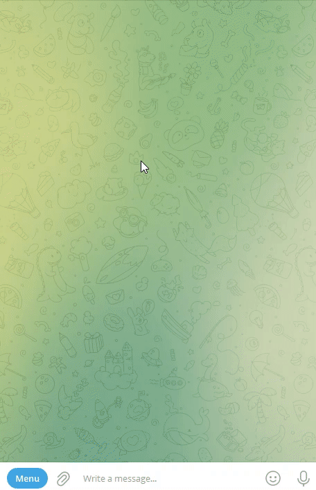
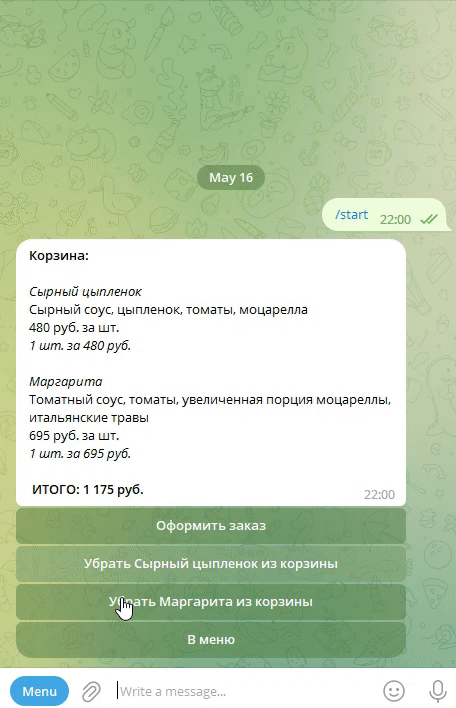
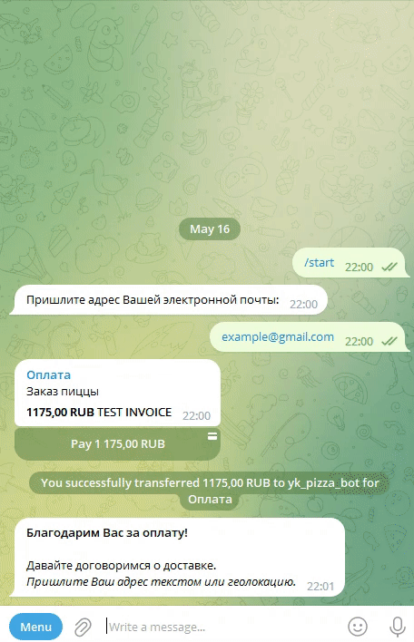

# Pizza shop telegram bot

Key features:

- The bot shows the menu;
- The user can go to the product details;
- The user can add products to the cart;
- The bot finds the nearest pizzeria and suggests a delivery or a pickup;
- The user can make a payment;
- The bot sends the user's location to the courier;
- Some time after the order, the bot sends an "Enjoy your meal" message with an ad;

**Picture 1.** _The user chooses pizzas_



**Picture 2.** _Payment_



**Picture 3.** _Delivery arrangement_



## Project components

The project works with the following components:

- The **Telegram shop bot** communicates with customers on the [Telegram](https://telegram.org/) platform;
- The **Facebook shop bot** communicates with customers on [Facebook](https://www.facebook.com/);
- The **Redis database** is used to save the current customer state ("in the menu", "in the cart" and so on). Go to [redislabs.com](https://redislabs.com/) to learn more about the Redis platform.
- The **Elastic store** is used as a [CMS](https://en.wikipedia.org/wiki/Content_management_system/); it stores information about products, prices, customers and so on. Go to [elasticpath.dev](https://elasticpath.dev/) to find out more about Elastic Path Commerce Cloud.

## Prerequisites

Python 3.11 is required.

## Installation

- Download the project files.
- It is recommended to use [venv](https://docs.python.org/3/library/venv.html?highlight=venv#module-venv) for project isolation.
- Set up packages:

```bash
pip install -r requirements.txt
```

- Go to [@BotFather](https://t.me/BotFather) and register your **Telegram shop bot**;
  - _Note_: Bots can't initiate conversations with users. You must send a message to your bot first;
- Go to [redislabs.com](https://redislabs.com/) and create your **Redis database**;
- Go to [elasticpath.com](https://euwest.cm.elasticpath.com/):
  - create your **Elastic store**;
  - add a price book;
  - add a catalog;
  - add a hierarchy `All` and parent nodes `Main`, `Others` (note: `Others` node should have maximum three children); the hierarchy should be like this:
    - `All`
      - `Main`
      - `Others`
        - `Special`
        - `Nutricious`
        - `Spicy`
  - add currencies;
  - add products; you can use the `load_menu.py` script to load products from the JSON file (see [Script `load_menu.py`](#script-load_menupy) for more);
  - add a flow `Pizzerias`; you can use the `create_pizzerias_model.py` script,  (see [Script `create_pizzerias_model.py`](#script-create_pizzerias_modelpy) for more);
  - add pizzerias entries; you can use the `load_addresses.py` script to load pizzerias from the JSON file (see [Script `load_addresses.py`](#script-load_addressespy) for more);
  - add latitude and longitude to the `customers` flow; you can use the `add_customer_location.py` script (see [Script `add_customer_location.py`](#script-add_customer_locationpy) for more)
- Set up environmental variables in your operating system or in .env file. The variables are:
  - `PIZZA_BOT_TOKEN` is your **Telegram shop bot** token from [@BotFather](https://t.me/BotFather) (obligatory);
  - `REDIS_HOST` is a public endpoint for your **Redis database** (obligatory);
  - `REDIS_PASSWORD`is a password for your **Redis database** (obligatory);
  - `REDIS_PORT` is a port for your **Redis database** (obligatory);
  - `ELASTIC_PATH_CLIENT_ID` is the **Elastic store** client ID  (obligatory);
  - `ELASTIC_PATH_CLIENT_SECRET` is the **Elastic store** client secret  (obligatory);
  - `ELASTIC_CATALOG_ID` is the **Elastic store** catalog ID (obligatory for the **Facebook shop bot**);
  - `ELASTIC_MAIN_NODE_ID` is the **Elastic store** main node ID; the node should be in the catalog hierarchy (obligatory for the **Facebook shop bot**); the products of this node will be displayed in the main  **Facebook shop bot** menu;
  - `ELASTIC_OTHERS_NODE_ID` is is the **Elastic store** "Others" node ID (obligatory for the **Facebook shop bot**) the children of this node will be displayed in the additional menu;
  - `YA_API_KEY` is your YANDEX API key that is used to suggest the nearest pizzeria (obligatory, go to [the developer cabinet](https://developer.tech.yandex.ru/) for more);
  - `REMIND_ORDER_AD` is an ad part of a message that is sent by the **Telegram shop bot** after the order (optional, "Заказывайте снова!" by default);
  - `REMIND_ORDER_HELP` is a help part of a message that is sent by the **Telegram shop bot** after the order (optional, "Если заказ не доставлен - звоните!" by default);
  - `REMIND_ORDER_WAIT` is an interval (in seconds) after the order, after which the bot sends an ad message (optional, 3600 by default);
  - `PAYMENT_TOKEN` is a token from one of the payment providers; you cat go to [@BotFather](https://t.me/BotFather) - your bot properties - Payments and get a test token, for example, from Sberbank;
  - `FACEBOOK_PAGE_ACCESS_TOKEN` is a token to access your Facebook page (obligatory for the **Facebook shop bot**);
  - `FACEBOOK_VERIFY_TOKEN` is a token to verify webhook access for your Meta application (obligatory for the **Facebook shop bot**);
  - `LOGO_URL` is an image URL that the **Facebook shop bot** uses in the title card of the menu (obligatory for the **Facebook shop bot**);
  - `ADDITIONAL_LOGO_URL` is an image URL that the **Facebook shop bot** uses in the additional menu title (obligatory for the **Facebook shop bot**);

To set up variables in .env file, create it in the root directory of the project and fill it up like this:

```bash
PIZZA_BOT_TOKEN=replace_me
REDIS_HOST=replace_me
REDIS_PASSWORD=replace_me
REDIS_PORT=13604
ELASTIC_PATH_CLIENT_ID=replace_me
ELASTIC_PATH_CLIENT_SECRET=replace_me
ELASTIC_CATALOG_ID=replace_me
ELASTIC_MAIN_NODE_ID=replace_me
ELASTIC_OTHERS_NODE_ID=replace_me
YA_API_KEY=replace_me
REMIND_ORDER_AD=Будем рады приготовить для Вас снова!
REMIND_ORDER_HELP=Если заказ до сих пор не доставлен, свяжитесь с нами!
REMIND_ORDER_WAIT=3000
PAYMENT_TOKEN=replace_me
FACEBOOK_PAGE_ACCESS_TOKEN=replace_me
FACEBOOK_VERIFY_TOKEN=replace_me
LOGO_URL=https://cdn.dribbble.com/users/404971/screenshots/1241486/media/462c5d611f788d7802591e86e561cdfd.png
ADDITIONAL_LOGO_URL=https://primepizza.ru/uploads/position/large_0c07c6fd5c4dcadddaf4a2f1a2c218760b20c396.jpg
```

## Script `load_menu.py`

The script loads products to the Elastic store. If the hierarchy ID and the node ID are provided, the relationships will be created too.

Usage of the `load_menu.py` script:

```bash
python load_menu.py [-h] [--file {file path}] [--hierarchy_id {hierarchy id}] [--node_id {node id}] [--price_book_id {price book id}]
```

Options:

- `-h`, `--help` - show the help message and exit;
- `--file {file path}` - path to JSON file to load, default: upload/menu.json, the example of the file is [here](upload/menu.json);
- `--hierarchy_id {hierarchy id}` - the hierarchy ID in the Elastic store;
- `--node_id {node id}` - the node ID in the Elastic store;
- `--price_book_id {price book id}` - the price book ID in the Elastic store. If this option is omitted, the prices of the products will not be loaded

## Script `create_pizzerias_model.py`

The script creates a flow `Pizzerias` with the following fields:

- `Address` (string);
- `Alias` (string);
- `Longitude` (float);
- `Latitude` (float);
- `Courier telegram ID` (integer);

Run:

```bash
python create_pizzeria_model.py
```

## Script `load_addresses.py`

The script loads entries to the Elastic store `Pizzerias` flow.
Usage of the script:

```bash
python load_addresses.py [-h] [--file {file path}] [--courier_tg_id {Courier telegram ID}]
```

options:

- `-h`, `--help` - show the help message and exit;
- `--file {file path}` - path to the JSON file to load, default: upload/addresses.json, the example of the file is [here](upload/addresses.json);
- `--courier_tg_id` - Courier telegram ID

## Script `add_customer_location.py`

The script extends the customer core flow in the Elastic store. It adds the following fields:

- `Longitude` (float);
- `Latitude` (float);

Run:

```bash
python add_customer_location.py
```

## Usage of the Telegram shop bot

- Start your **Telegram shop bot**:

```bash
python tg_bot.py
```

- Go to the bot and start shopping.

## Project goals

The project was created for educational purposes.
It's a lesson for python and web developers at [Devman](https://dvmn.org/).
